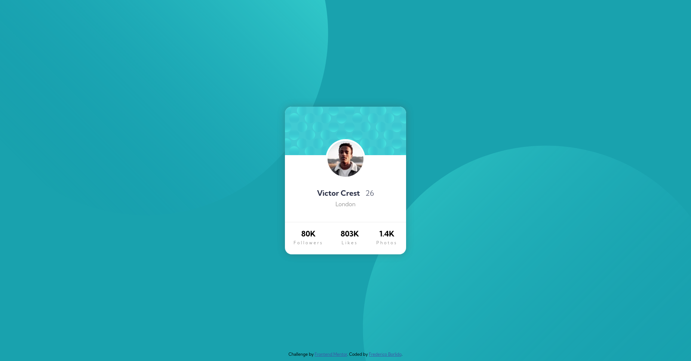
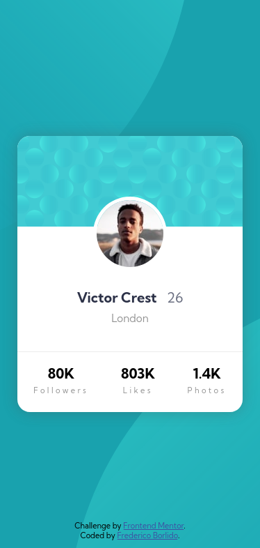

# Frontend Mentor - Profile card component solution

This is a solution to the [Profile card component challenge on Frontend Mentor](https://www.frontendmentor.io/challenges/profile-card-component-cfArpWshJ). Frontend Mentor challenges help you improve your coding skills by building realistic projects. 

## Table of contents

- [Overview](#overview)
  - [The challenge](#the-challenge)
  - [Screenshot](#screenshot)
  - [Links](#links)
- [My process](#my-process)
  - [Built with](#built-with)
- [Author](#author)

## Overview

### The challenge

- Build out the project to the designs provided

### Screenshot

- Desktop:

- Mobile:

### Links

- [Solution URL](https://github.com/fm-profile-card)
- [Live Site URL](https://fborlido.github.io/fm-profile-card)

## My process

### Built with

- Semantic HTML5 markup
- SCSS custom properties
- Flexbox

## Author

- Website - [Frederico Borlido](https://www.github.com/fborlido)
- Frontend Mentor - [@fborlido](https://www.frontendmentor.io/profile/fborlido)
